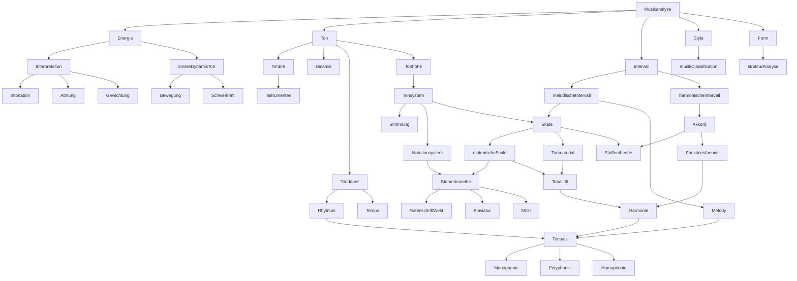

## Musikalische Dimensionen (*Musical Features*)

Musikanalyse hat verschiedene Aspekten(Dimensionen) -  **Musical Features**. Für Algoritm wird oft *EDA/Exploration Data Analysis* Method mit *Visualitation* benutzt. Um *Feature Extraction* zu bestimmen brauchen wir *Musical Features*.

Hier in Diagramm sehen wir die Hierarchie und Zusammenhang von denen:

Die wissenschaftliche Gebiete für Implementation von Algorithmen :

1. Mathematik (Harmonische analyse, Funktionsanalyse, Linearalgebra, Komplexeebene, Calculus)

2. Physik (Akustik, Schall)

3. Psychologie( Tonpsychologie,Musikpsychologie,Wahrnehmungspsychologie)

4. Musiktheorie

5. 