# Datenanalyse

*Music Data analysis* - ist eine Datananalyse, aber mit Vertiefung in  Musikalische und Akustische Bereich.

```mermaid
sequenceDiagram
    Datenanalyse->+ MusikDatenanalyse: Daten Erfassen
    MusikDatenanalyse-->>-Datenanalyse: Music Representation
    Datenanalyse->+MusikDatenanalyse: Daten bearbeiten 
    MusikDatenanalyse-->>-Datenanalyse: Music Processing
    Datenanalyse->+MusikDatenanalyse: Analyse, Daten modelieren
    MusikDatenanalyse-->>-Datenanalyse: Musik Analyse
    Datenanalyse->+MusikDatenanalyse: Präsentieren
    MusikDatenanalyse-->>-Datenanalyse: Neue Information über Musik





```

## 1. Zielsetzung

Bevor wir zu Analyse kommen. Sollen wir erst mal Ziel von Analyse setzen und dann auf Fragen antworten.

Hier ist die Beispiel mit Fragen:

- Welche Ziel haben wir? Was wollen wir aus der Daten erhalten?: **Zielsetzen**

>Wie intesiv oder ruhig Musik ist?

- Wie sehen unsere Daten aus? - **Musikrepresentation, Daten**

>PCM-Audiosygnal

- Welche Information aus Daten kann bei Analyse helfen? - ***Die Features, Music-labels* bestimmen**

>Dynamik Charakteristik

- Welche Method von Musikanalyse sollen wir am besten verwenden? - **Die Metohds von Datenanalyse aussuchen**

> EDA Method

## 2. Music Representation und Daten

Während der Analyse die Arbeit mit Daten eine wichtige Teil: 

 - Welche `Input Data` haben wir? 
 
 - In welche Form von **Music representation** wollen wir am besten wärhrend des Analyse die musikalische Daten visualisieren?
 
 - Wie sollen die `Output Data` sich aussehen?

###  Welche Unterschied zwischen **Music representation** und `Data`?

| Music Representation | Data |
| :---------:|:------:|
|(Westliche) **Notenschrifft** *Staff notation*  |*Image Data(pixel)* `.png`|
|          |*Vectorgraffic*  `.pdf``.svg`|
|          |*XML Data*  `.mxml` `.mei`|
|          |Textbasierte Notensatzpogramm `Lilypond`,`Verovio`|
|          |Notensatzprogram mit eigene Datetype `Sibelius`, `Dorico`, `Finale`, `MuseScore`|
|**Piano-roll**| *MIDI* `.mid`|
|       | Tabular Data (*Sheet*) `.csv`|
|**Sheet** | Tabular Data `.csv`|
|     | MIDI `.mid`|
|**MIDI** *Instrument*| MIDiI `.mid`|
|**Waveform** *Time domain*| *Digital Audio* PCM-Sygnal `.wav`, `.aiff`|
|**Fourier Representation** Frequency domain | *Digital Audio* PCM-Sygnal `.wav`, `.aiff`

## 3. Methods von Datenanalyse

Hier ist ein Beispiel von **EDA** (*Exploration Data Analysis*) and **Feauture Extraction** in Musikprocessing. 
(["Audio-Based music structure analysis" ISMIR2010](https://www.researchgate.net/publication/289662964_Audio-based_music_structure_analysis))

