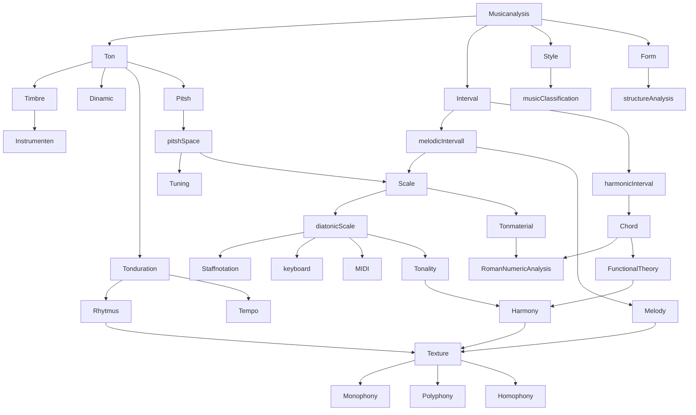

## Musical Features

Music analysis has differnet musically meaningfull labels - **Musical Features**. We need to specify and select the **Features** to use them in Music Data Analysis. Commonly used the **EDA-Approuch**(exploratory data analysis) with Visualitation. 

The hierarchy of **Musical Features** and their connection:

