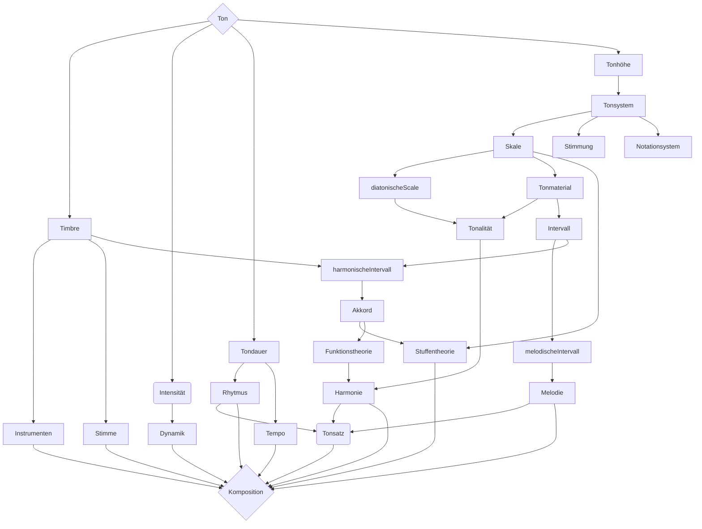
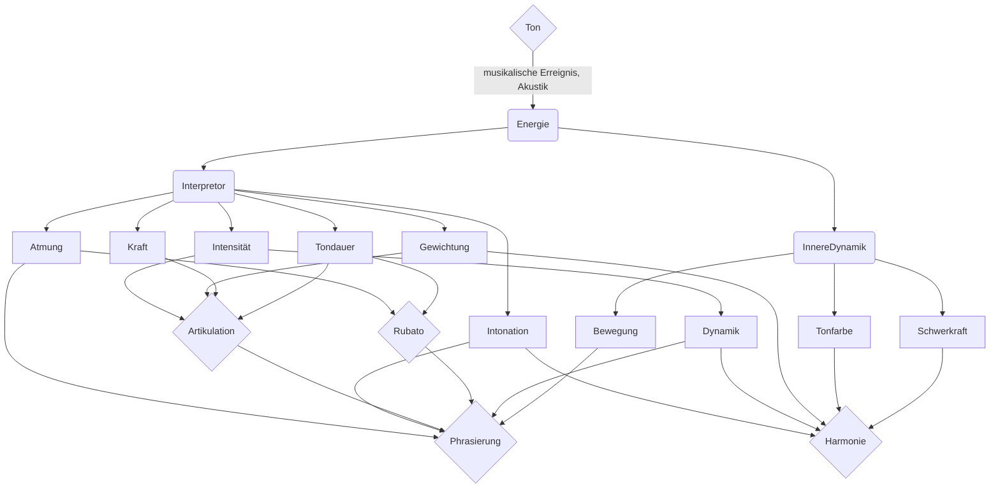

#  Musikalische  Features

## Akustik Features bei Musikalische Erreignis und Interpretation:

Hier werden wir gleich sehen , dass nicht nur klasische **Musikalische Charakteristik** von **Komposition** vorhanden sind , auch  **akustischer Charakteristik** von **Musikalischer Erreignis** (Interpretation) analysiert wird. 

1. Beispiel : Ein Genre von Musik Jazz: Die Akkorden haben dor kaum funktionale Bedeutung,  mehr als Klangfarbe von Töne in der Melodie oder die bestimmte harmonische Zustände, wie der Fluß in eine Farbpallette."**Gefärbte Skale**", wenn man so sagen darf"

2.  Beispiel:  Funktionsanalyse von Akkorden auch von **Interpretation**(Spielen,so zu sagen) abhängig ist. Die Beachtung von Gewichtung, Atmung, Intonation, Energie des Spielers. Mann kann ein **leicht gespieltes Akkord**, einfach als zwischenschritt ohne Harmonie zu bestimmen, sehen. Oder Man kann das gleiche Akkord, aber  **schwergespielt**, als wichtiger Funktion zu Betrachten.

3. Beispiel: Tempo bei jedem Spieler ist nicht gleich. So dass bei Sinchronisation das muss beachten werden

4. Beispiel: in kleines Rubato (nicht deutig gespieltes Rhytm und Tempo) , Atmung hat jeder guter Spieler. Das ist, wie Vorlesen von geschriebene Text.

5. Beispiel: Intonation - ist die Verbindung und Verhältnis.

Die Idee ist nicht neue, schon viele Wissenschaftler viel erforscht haben, wie die
 **Energetik** des **Spieler** sofort auf Zuhörer akustish, psychologish ein Einfluß hat. 

 > "Musikalischer Form als Prozess" , "vergleichens jedes intonierten Moments im Verlauf der Musik"

 sieht zum Beispiel B. Assafiew in seine Intonationslehre. 

Begriff "**Innere Dynamik des Klanges**" hat Halm in seiner "Harmonielehre" erlätert: 

> Jeder Ton der Tonleiter hat seine natürliche Erklärung, als Intervall irgandeines kadenzakkordes"
 