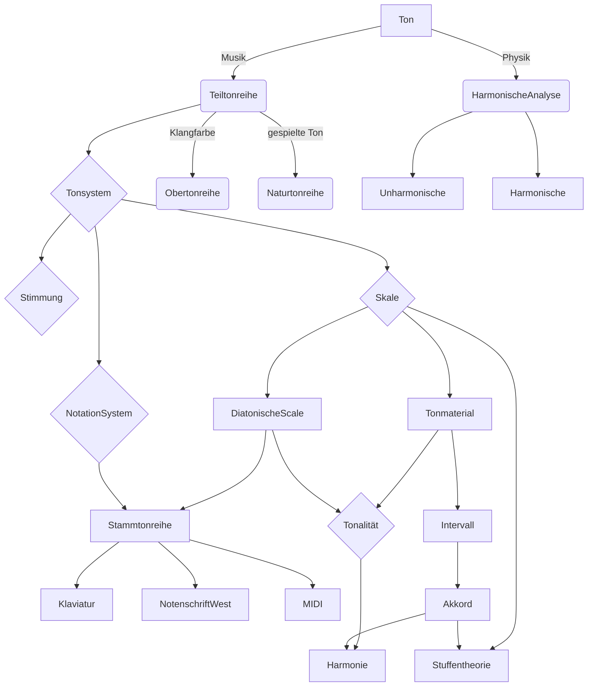

# Tonsystem

## 1. Teiltonreihe

### 1.1 Naturtonreihe 

 >klingelde Teiltonreihe bei Instrumenten

### 1.2 Obertonreihe

 > Die Obertonspektrumanalyse für Klangfarbe und Instrumeten, Stimme 

### 1.3 Harmonische , Unharmonische

> Die nichtharmonische Instrumenten und Klänge 

### 1.4 Teiltonreihe, als Basis für Tonsystem

> Tonhöhe, Octave, Intervalls

## 2. Tonsystem

> Die verschieden Verteilung von Oktave

## 3. Stimmung

## 4. Skale

> Die verschiedene Tonverhältnis in Scale

### 4.1 Tonmaterial für Intervalle, Akkorden

> Akkorden-Stuffenanalyse

## 5. Tonalität

>Diatonische Skale, als Basis für Tonalität

