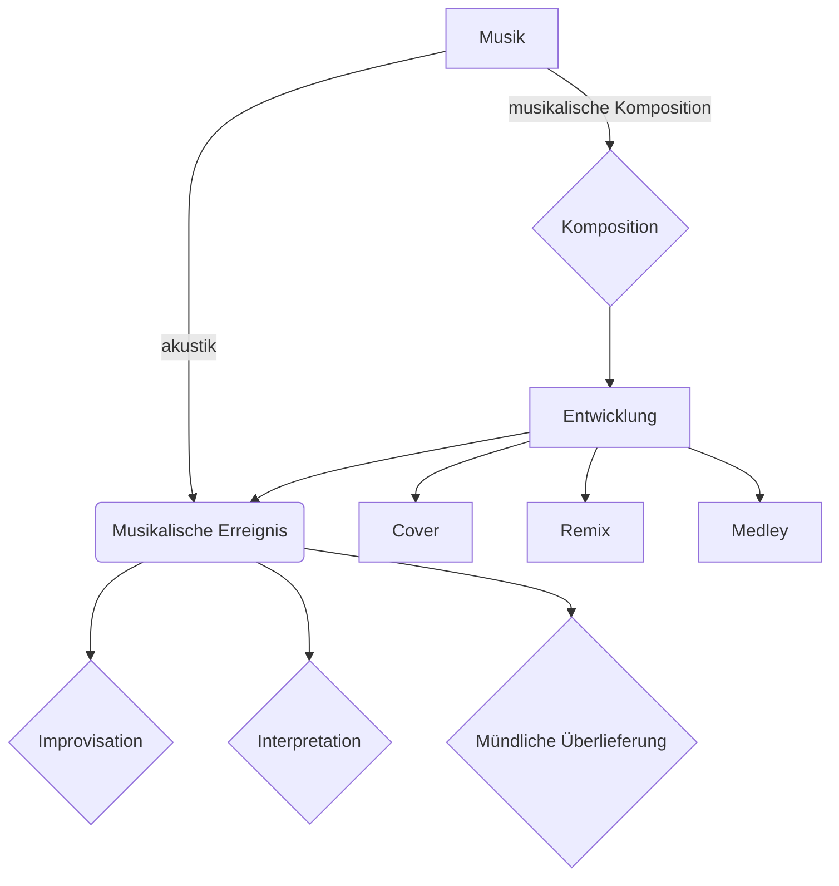

# Musik Datenanalyse 

Bei Musik Datenanalyse steht im Mittelpukt das Wort **Analyse**. Die Musikdaten werden erfasst, analysiert und bestimmte Ergebnisse präsentiert. 

Das Ziel ist- die neue Information, Erkenntnisse über Musik aus digitale Daten zu bekommen und dann sie representiren. 
Die Ergebnisse können gut gebraucht sein in: 

- **Application**

- **Musikwissenschaft**

- **Musikforschung**

- **Musikindustry**

- **MIR**

- **Music Processing**

Was ist das Unterschied zu Music Processing? Bei **Music Processing** ist das Mittelpukt **Bearbeiten**(Processing).   Praktische Algorithms , für Bearbeitung von Musikdaten. Das ist ein rießieges Feld, von einfache Sygnalprocessing bis zu **Application**, **Forschung** . **MIR** (*Music Information retrieviel*) ist eine Wissenschafft, Forschung, wo wird viel erforscht und neue Algorithmen erfasst. Music Processing ist ein praktische Teil davon:

> When teaching and learning music processing, it is essential to have a holistic view of the MIR task at hand, the algorithmic approach, and its practical implementation. Looking at all the steps of the processing pipeline sheds light on the input data and its biases, possible violations of model assumptions, and the short- comings of quantitative evaluation measures.
(["Fundamentals of Music Processing"M.Müller](https://www.audiolabs-erlangen.de/fau/professor/mueller/bookFMP))

##  [Datenanalyse in Musik](datenanalyse_musik.md)

##  Musikanalyse

Für jeder Datenanalyse setzt man erst mal das Ziel *Task*. Was würden wir gern analysieren oder  welche musikalische Charakteristik *Feautures* ,brauchen wir? 
´

## [Musikalische  Charakteristik](musik_charakteristik.md)

### Fundamentale Charakteristik von Musik : 
### 1.  [Ton](musik_datenanalyse/ton.md)
  
### 2. [Tonsystem](musik_datenanalyse/tonsystem.md)

### 3.  Dynamik

### 4.  Rhytm

### 5. Tempo

### 6.  Timbre,Klangfarbe

### Die komplexe Analyse: 

### 1.  Melodie

### 2.   Harmonie
### 3. Tonsatz

### 4. Form, Struktur

----
# Anhang:

## [Methodik](methodik.md)
## [Implementation](implementation/mathematik.md)

## [Musikalische Begriffe in Deutsch und Enlisch](begriffe.md)
## [Referenzen](Quellen.md)

