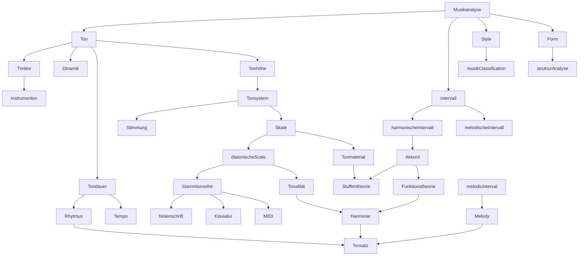
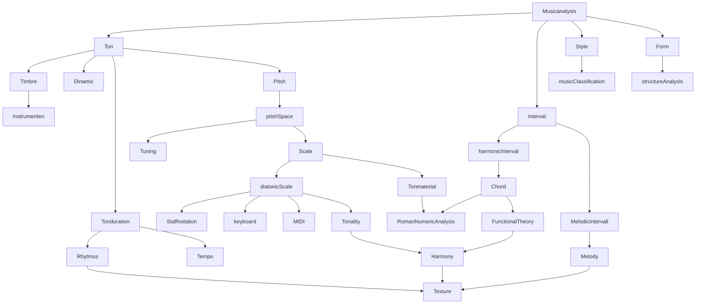

## "Musical Tone and his Feautures"   

### *computational music analysis/music data analysis*

Plan and Referenzen to Jupiter Notebooks (englich):

[Music tone](musical_tone_englisch.md)

---

## "Ton und sein Charakteristik"

### *computergestützte Musikanalyse/musikalische Daten Analyse* 

Plan und Referenzen zu Jupiter Notebooks(deutsch):

 [Musikalische Klang](musikalische_klang_deutsch.md)

---
## Ton in Musikanalyse

> Musikanalyse hat verschiedene Aspekten(Dimensionen)-  **Music Features**. Für Algoritm wird oft *EDA/Exploration Data Analysis* Method mit *Visualitation* benutzt. Die *Feature Extraction* zu bestimmen baruchen wir **Music Features**! Hier in Diagramm sehen wir die Hierarchy und Zusammenhang von denen. 

---

> Music analysis has differnet musically meaningfull label - Music Features. They specify the  Feature Extraction in Algorithm.

---

[Musikalische Begriffe in Deutsch und Enlisch](begriffe.md
)

**Quellen:**

*Wikipedia:*

[Tonsystem](https://de.wikipedia.org/wiki/Tonsystem)

[Harmonic](https://en.wikipedia.org/wiki/Harmonic)

